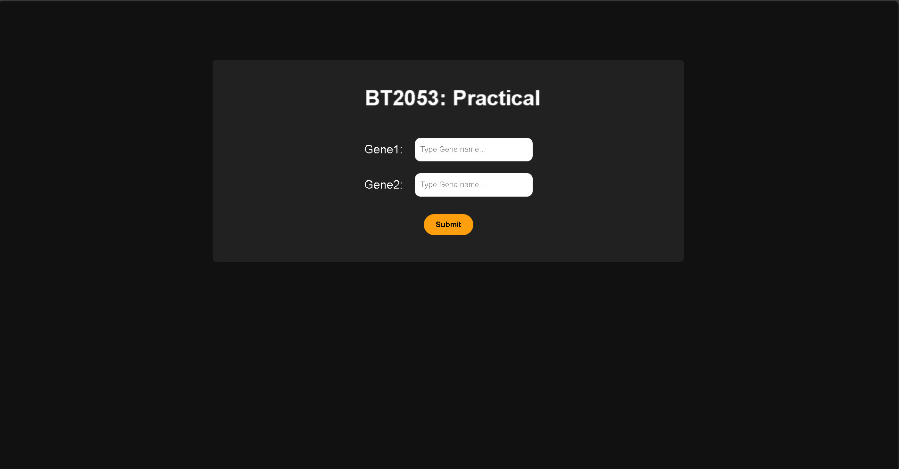
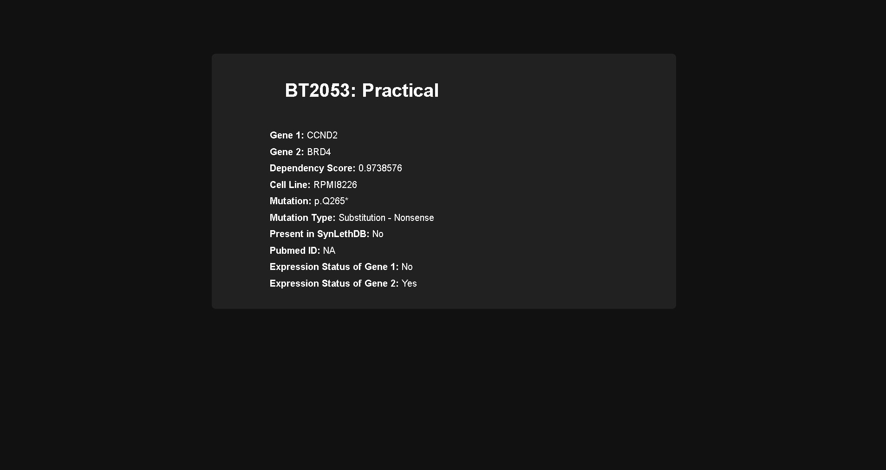

# Gene Interaction Query Tool

This project was created as part of the **BT2053: Big Data Biology and Databases** course. It demonstrates a simple web application that queries a database for synthetic lethality interactions between genes using PHP, SQL, and a frontend form.

## Table of Contents
- [Overview](#overview)
- [Screenshots](#Screenshots)
- [Tech Stack](#tech-stack)
- [Features](#features)
- [Database Structure](#database-structure)
- [Setup Instructions](#setup-instructions)
- [Usage](#usage)
- [License](#license)

## Overview
The project uses a MySQL database to store gene interaction data. Users can input two genes (`gene1` and `gene2`) via a web form. If the provided genes exist in the `sl_interactions` table and the `expression_status` for `gene2` is `Yes`, the entire row is retrieved and displayed on the frontend.

## Screenshots

### 1. Input Form
The form allows users to input `Gene1` and `Gene2`.



### 2. Query Result
Displays the details of the queried gene pair when found.



## Tech Stack
- **Frontend**: HTML, CSS
- **Backend**: PHP
- **Database**: MySQL (via phpMyAdmin)
- **Server Environment**: XAMPP

## Features
- Accepts user input for `gene1` and `gene2`.
- Validates the data by checking the database.
- Displays the entire row for valid `gene1` and `gene2` if the `expression_status` of `gene2` is `Yes`.

## Database Structure
The database contains a table called `sl_interactions` with the following columns:
| Column Name               | Data Type          | Description                                          |
|---------------------------|--------------------|------------------------------------------------------|
| Gene1                    | `VARCHAR`          | Name of the first gene                              |
| Gene2                    | `VARCHAR`          | Name of the second gene                             |
| Dependency Score          | `FLOAT`           | Score indicating dependency level                   |
| Cell Line                 | `VARCHAR`          | Cell line used in the interaction study            |
| Mutation                  | `VARCHAR`          | Mutation associated with the interaction           |
| Mutation Type             | `VARCHAR`          | Type of mutation (e.g., Substitution - Nonsense)   |
| Present in SynLethDB      | `VARCHAR`          | Indicates if the interaction is in SynLethDB       |
| Pubmed ID                 | `VARCHAR`          | Reference PubMed ID                                |
| Expression status of Gene1| `VARCHAR`          | Expression status of Gene1 (Yes/No)                |
| Expression status of Gene2| `VARCHAR`          | Expression status of Gene2 (Yes/No)                |

### Example Row:
| Gene1  | Gene2  | Dependency Score | Cell Line | Mutation  | Mutation Type            | Present in SynLethDB | Pubmed ID | Expression status of Gene1 | Expression status of Gene2 |
|--------|--------|------------------|-----------|-----------|--------------------------|-----------------------|-----------|----------------------------|----------------------------|
| CCND2  | BRD4   | 0.9738576        | RPMI8226  | p.Q265*   | Substitution - Nonsense  | No                    | NA        | Yes                        | Yes                        |

## Setup Instructions
1. **Install XAMPP**:
   Download and install XAMPP from [apachefriends.org](https://www.apachefriends.org/).

2. **Set up the database**:
   - Open phpMyAdmin (`http://localhost/phpmyadmin`).
   - Create a new database (e.g., `gene_database`).
   - Import the `sl_interactions` table into the database:
     1. Click on your database name.
     2. Go to the **Import** tab.
     3. Upload the SQL file containing the `sl_interactions` table schema and data.

3. **Add the project files**:
   - Place the project folder (containing `index.html`, PHP scripts, and any assets) into the `htdocs` directory of your XAMPP installation.

4. **Configure the database connection**:
   - Open the PHP script handling the SQL queries (e.g., `insert.php`).
   - Update the database connection details:
     ```php
     $servername = "localhost";
     $username = "root";
     $password = "";
     $dbname = "gene_database"; // Replace with your database name
     ```

5. **Start the server**:
   - Open the XAMPP Control Panel.
   - Start **Apache** and **MySQL**.

## Usage
1. Open a web browser and navigate to `http://localhost/{your-project-folder}/index.html`.
2. Enter `gene1` and `gene2` in the form.
3. Submit the form.
4. If the genes exist in the `sl_interactions` table and the `expression_status` for `gene2` is `Yes`, the corresponding row will be displayed.

## Example
### Input:
- `Gene1`: **CCND2**
- `Gene2`: **BRD4**

### Output:
| Gene1  | Gene2  | Dependency Score | Cell Line | Mutation  | Mutation Type            | Present in SynLethDB | Pubmed ID | Expression status of Gene1 | Expression status of Gene2 |
|--------|--------|------------------|-----------|-----------|--------------------------|-----------------------|-----------|----------------------------|----------------------------|
| CCND2  | BRD4   | 0.9738576        | RPMI8226  | p.Q265*   | Substitution - Nonsense  | No                    | NA        | Yes                        | Yes                        |

## License
This project is developed for educational purposes as part of a course. No specific license is applied.
